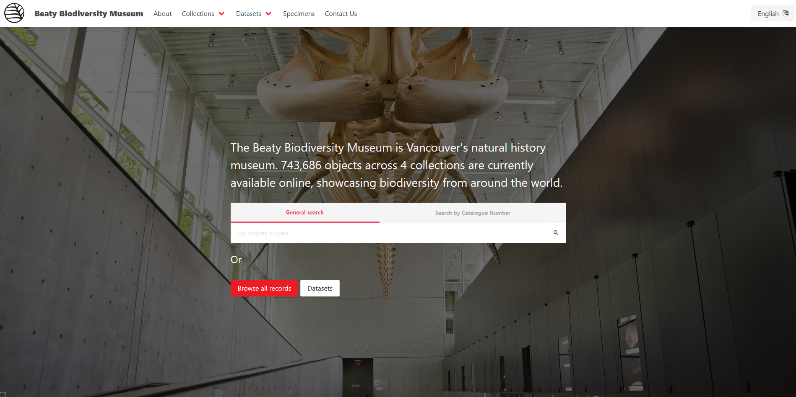
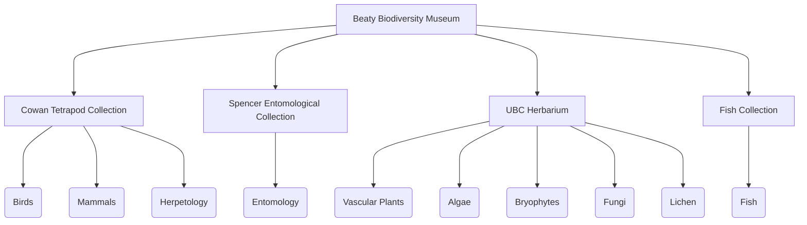

---
tags:
  - GBIF
---

# Overview

- <https://collections.beatymuseum.ubc.ca>

The data portal allows anyone, anywhere in the world to access information about specimens at the Beaty Biodiversity Museum. Data can be searched on a per dataset basis, or across the whole museum.

<figure markdown>
  
  <figcaption>Homepage of the BBM GBIF Data Portal</figcaption>
</figure>

## Data Source

All data is automatically synced between GBIF and the website through GBIF's API. This means that if the data has been published to GBIF it will be accessible through the portal. Data is published at different frequencies for each collection, depending on the size and frequency of updates.

### Images

Images are not hosted by GBIF, rather they are served by a CDN. You may access any image directly from your browser if you know the `catalogNumber` of a specimen. For example, to access the image of the Steller's Jay (B000003), you may use <https://beaty.b-cdn.net/B000003.jpg>. All files are in `jpg` format and will therefore end in `.jpg`. If there are multiple images for the same specimen, the first time will contain no suffix, and the rest will end in `a`, `b`, `c` etc.

!!! example

    Pick a catalog number and try it out! The link will always follow the form `https://beaty.b-cdn.net/` + `catalogNumber` + `.jpg`. The presence of leading zeros in catalogNumbers varies by dataset, but we are actively working to standardize this.

## Identifiers for Collections and Datasets

The Beaty Biodiversity Museum consists of 6 collections (4 with data currently published) and 10 datasets. The identifiers and codes for each are listed below. Datasets exist as a _subset_ of collections. There can be many datasets under one collection. The tree for those collections with data is outlined below:

### Collections

Any particular collection can be accessed through `https://collections.beatymuseum.ubc.ca/collection/{identifier}`

The value for `{identifier}` can be referenced [here](../reference/key-reference.md)

### Datasets

Any particular dataset can be accessed through `https://collections.beatymuseum.ubc.ca/dataset/{identifier}`

The value for `{identifier}` can be referenced [here](../reference/key-reference.md)

*[API]: Application Programming Interface
*[CDN]: Content Delivery Network