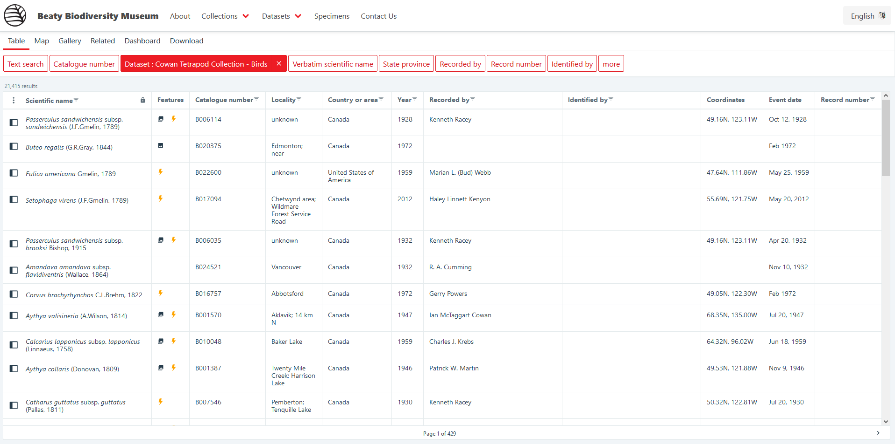

# Navigating to a particular dataset

If you are interested in jumping straight into a particular dataset, you can select the dataset from the top navigation bar. Hover over `Datasets` and then click on the name of the dataset that you are interested in. This will open up the dataset summary page.

<figure markdown>
  
  <figcaption>Dataset summary page for Birds</figcaption>
</figure>

The dataset summary page displays metadata about the dataset, including high level statistics about taxonomy, number of specimens, and when specimens were collected.

If you want to jump straight into the _records_ of a particular dataset, you can click on the black text below the map which tallies up all occurrences for the dataset.

Most buttons on the dataset summary page will take you to a view that is already filtered. __For example, clicking on the occurrence tally will open up the table view with a filter for the birds dataset already applied__.

<figure markdown>

  <figcaption>Table view with filter for Birds dataset</figcaption>
</figure>

All further filters will be applied within the birds dataset.

!!! warning

    Navigating to a dataset in this way activates the filter for that dataset to only display records from that dataset. However, if the filter is removed, then you will see records that are from elsewhere in the museum. If you do accidentally remove the filter, you can add it again by selecting the dataset filter box, and selecting the dataset you are interested in.