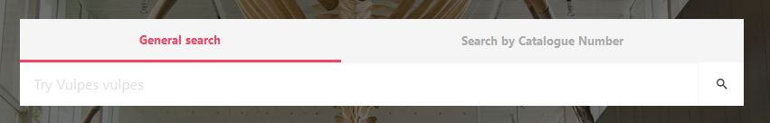
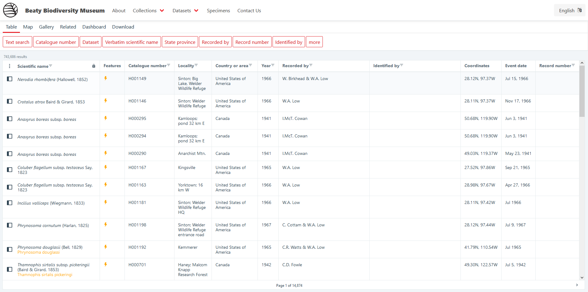

# Searching for specimens on the portal

There are many ways to find the data you are looking for through the portal. When searching there are two important things to keep in mind:

1. All data for the museum exists in a single pool. From that pool, filters are applied to get more specific subsets of the data.
2. The type of filtering operations possible depend on the type of data in the field you are searching on. For instance, when searching on a number, it is possible to do `Greater than` or `Less than` filtering, but this is not possible for a field that is text.

## Using the search box on the homepage

<figure markdown>
  
  <figcaption>Search box on the homepage of the portal</figcaption>
</figure>

In the middle of the image on the homepage there is a search box. This search box can be used to perform two types of searches:

1. A general search on all fields
2. Search based on a `catalogNumber`

The usefulness of the general search depends on the specificity of the term you are searching for. For example, `Vulpes vulpes` will return all records with that scientific name, and there is little conflict with the names of people or places. A search for `Cowan` on the other hand, would return all results in the Cowan Tetrapod Collection, and any other records which had the text `Cowan` in any field.

If searching by catalog number, the full catalog number must be entered, including the capital leader. Some collections will use leading zeroes, while others will not, however this is something that we are working on standardizing.

## Applying filters in table view

To learn about filters, we will start with looking at _all_ of the data at the museum. The data that is displayed to you will not match the data shown in the screenshots below, however the buttons will perform the same functions and be in the same location. You can get to this page by hitting `Browse all records` from the homepage or navigating to <https://collections.beatymuseum.ubc.ca/specimen/search>

<figure markdown>
  
  <figcaption>Browsing all records in table view</figcaption>
</figure>

### Using search filter boxes

Based on what people search for most, there are fields contained in red boxes that run across the top of the table. If you click on one of these red boxes, you can filter for that particular field. 

<figure markdown>
  
  <figcaption>Red search pills across the top of the table</figcaption>
</figure>

If the field that you are interested in is not contained within these search boxes, you can click `more` to get a dropdown of all fields that can be searched.

### Using column headers

Another way to search is through the column headers. Beside each column headers is a :material-filter-variant: icon. Pressing this icon will open up the search interface for that field.

<figure markdown>
  
  <figcaption>Column headers with filter icon</figcaption>
</figure>

### Using a coordinate polygon

The `Location` search parameter is special. It will bring up a tool that allows you to draw a polygon on a map, or define a range, to filter data.

!!! example

    If I want to search for all records found on UBC campus I can select the Location filter and then click the :material-pencil: icon. By drawing a complete polygon and then hitting `Apply` I will filter for all records that have a coordinate within that polygon.
    
    <figure markdown>
    
    </figure>

A geospatial issue is when there is a perceived issue with the coordinate. For example, the country and coordinate may not match, or the coordinates may be deemed likely to have been flipped.

## Applying filters in map view

If you would like to search using a map instead of filtering for fields, the portal supports this functionality. To search based on location:

1. Navigate to the `Map` tab
2. Position the map such that the area presented on your screen is the area you would like to filter for. Then, click the :material-filter: icon in the top right corner.

This filter will persist regardless of what view you are in. If you want to see the data associated with the records in the area, you can select `Table` and view the data.

<figure markdown>
  
  <figcaption>Filtering by visible area</figcaption>
</figure>

