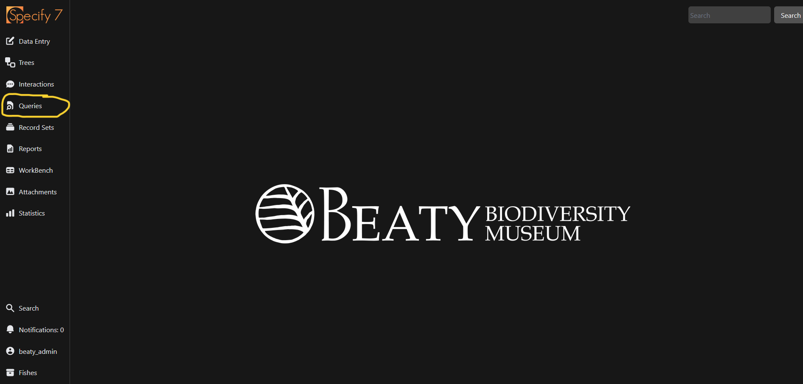
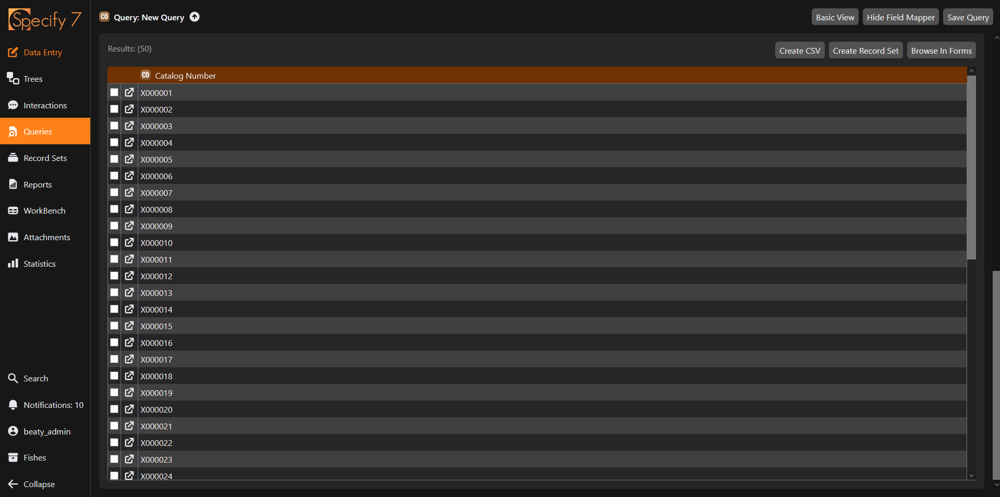

---
tags:
    - Specify
    - Queries
icon: material/database-search
---

# Queries

!!! info 

    There is a Specify documentation page about the technical details of queries that can be found [here](https://discourse.specifysoftware.org/t/query-builder-in-specify-7/289)

Queries are the main way to access existing data within Specify. This powerful tool can be used to access almost any field within the database, using logical operators specific to each fieldtype.

## Learning Objectives

By the end of this page, you will:

- [ ] Navigate to the query tool
- [ ] Create a query to lookup Collection Objects based on a catalogNumber range
- [ ] Create a query to lookup Collection Objects based on information in a related table
- [ ] Save a query so that you can use it later
- [ ] Share a query with another Specify user through a hyperlink
- [ ] Share a query with another Specify user through a `.json` file.
- [ ] Understand how queries are scoped within the system

## Opening up the query tool

To get started with using the query tool, select `Queries` in the navigation menu.

<figure markdown>
  
  <figcaption>Accessing Queries from the homescreen</figcaption>
</figure>

This will open up a modal with all of your saved queries. You can either select an existing saved query or create a new query by clicking on the `New` button in the bottom right corner. The queries displayed to you are unique to your user, and not available to anyone else by default. However, you can [share queries with other users](#sharing-queries). For now, let's hit the `New` button to build a query from scratch.

!!! quote ""

    - [x] Navigate to the query tool

## Creating a new query

To create a new query, you will:

1. Select fields from the schema that you wish to query
2. Apply logical fields to those fields which you have selected.

Only the fields that you select from the schema will show up in the results returned by the query. If you want to include a field in the results, but not perform any filtering on it, leave the logical selector as `Any`. The full list of available logical selectors are outlined below.

| Operator | Action |
| -------- | ------ |
| Any (default) | Does not apply any filtering, however a field must be added with this operator to show in the results. |
| Like | Search based on a pattern. `%` represents zero or more characters. `_` represents a single character. |
| Equal | Returns exact matches only. |
| Equal | Returns exact matches only. |
| Greater than, less than, greater or equal to, less or equal to | Function as expected with numerical fields or dates. |
| Between | Returns matches that fall between the minimum and maximum specified. *Note that this can be used for catalogNumbers, even though there is an alphanumeric character in the format.* For example, between `X000001` and `X000050` will work. Can also be used with dates. |
| In | Can be used to search based on comma separated values. For example `X000001, X000003, X000005` will return those three Collection Objects are the results. If you are using the operator on a Pick List, you can hold down ++ctrl++ or ++cmd++ to select multiple values from the list |
| Contains | Returns any result that contains the string |
| Empty | Returns results that do not have a value for the field |
| True/False | Used for boolean fields (usually represented by checkboxes). `True` is for checked, `False` is for unchecked. `True or Empty` should be used when filtering for Collection Objects with current determinations for export. |

### Querying for Collection Objects within a catalogNumber range

Let's say that we want to display all catalog numbers in the database. We first need to know which table contains the catalog number field. We can look this up in the reference section. Upon doing so, we would see that catalog number is contained within the Collection Object table. This indicates that we should select Collection Object as the base table when creating our new query.

<figure markdown>

<figcaption>Selecting the base table for a new query</figcaption>
</figure>

Upon selecting our base table, this will open up the main query interface. In the top left, is where we select fields from. After selecting the field and clicking :material-plus: the field will be added to the list of selected fields, shown in the bottom of the screen. By default, the logical operator will be `Any`. We can then change the operator to be `Between` by clicking on the dropdown. 

<figure markdown>

<figcaption>Adding Catalog Number to the fields to display in the query results</figcaption>
</figure>

Hitting `Query` in the bottom right hand corner or ++enter++ will run the query against the system, and return the appropriate results.

<figure markdown>

<figcaption>The results of running a query for Collection Objects with the between operator</figcaption>
</figure>

!!! quote ""

    - [x] Create a query to lookup Collection Objects based on information in a related table

From the results panel, we can either

- Create a CSV. Note, this will only contain the columns as shown in the results panel.
- Create a record set. This will create a grouping of Collection Objects that were included in the query. In this instance, that would be all Collection Objects since catalog number was filtered on any.
- Browse in Forms. This will create a popup that has a form for each record.

By default, whatever option from the above is selected, all records will be included. If only some records should be included, the checkboxes can be used to select only some records.

### Querying for Collection Objects, showing fields in related tables

There may be information in a *related* field that we wish to see in the results of the query. To access these fields, we need to first move into the related table.

Let's say that we want to show the `Collecting Event Number` for each `catalogNumber`. As the `Collecting Event Number` is not in the Collection Object table, we need to first open the fields in the `Collecting Event` table. Since we don't want to apply any filtering to the `Collecting Event Number`, we will use the `Any` operator.

<figure markdown>

<figcaption>Querying for a field related to the base table</figcaption>
</figure>

This will return the two columns in the results

<figure markdown>

<figcaption>Results with catalogNumber and Collecting Event Number</figcaption>
</figure>

!!! quote ""

    - [x] Create a query to lookup Collection Objects based on information in a related table

## Saving Queries

If you like the query that you have built, you can save your query for another time. Hit `Save Query` to name it. The next time you go to queries, you can open it up and use it more quickly. If you hit `Save query` while using one of your saved queries, it will update any changes that you've made. `Save Query As` will save the query, but under a new name (similar to how saving files in other programs).

!!! note 

    Saving a query will add the query to the saved queries list for your user. It will not save the query to the saved queries list of other users. *However*, other users, provided they have the necessary permissions, can access your query via its url (explained in further detail below)

!!! quote ""

    - [x] Save a query so that you can use it later
    - [x] Understand how queries are scoped within the system

## Sharing Queries

There are two ways you can share queries with other users:

### Through a link
This method works well if you want to quickly share a query that isn't intended to be permanent. To share the query, simply copy the query link from the browser address bar and send it to the user you wish to share it with through any means. Assuming that they have the necessary permissions, they will be able to simply click on the link and open the query.

A query link should look like `https://database.beatymuseum.ubc.ca/specify/query/{int}` where `{int}` is some integer.

!!! quote ""

    - [x] Share a query with another Specify user through a hyperlink

### Through a file

#### Turn a query into a text file
You can export a query as a text file. To do this:

1. Ensure your query is saved (see section above)
2. Click on :material-note-search-outline: Queries in the navigation menu. Then, click on the :material-pencil: beside the query you wish to export.
3. Click on `Export`. This will allow you to save the query as a .json file.

#### Use a text file to create a query
The user that wishes to use a query shared with them as a text file, should:

1. Click on :material-note-search-outline: Queries in the navigation menu.
2. Click on `Import` and select the .json file of the query. The query will now appear in the system.

!!! quote ""

    - [x] Share a query with another Specify user through a .json file.
