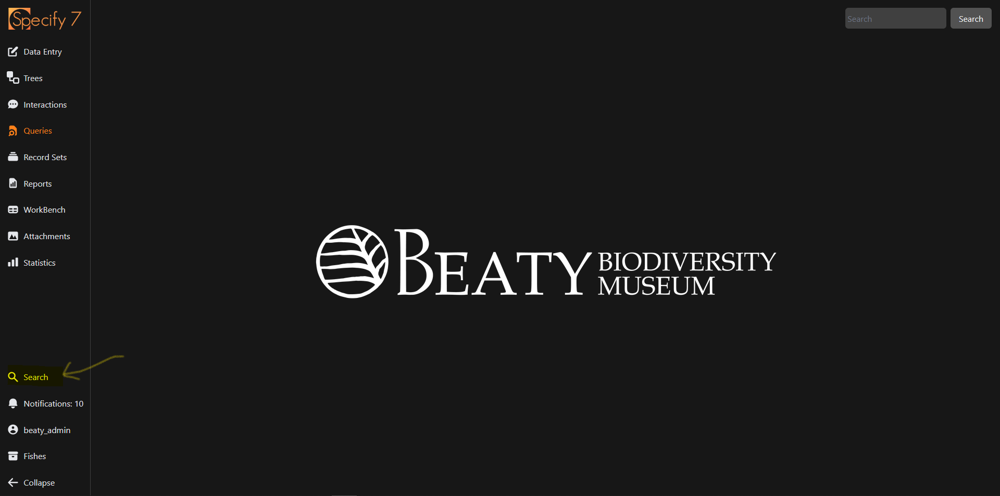
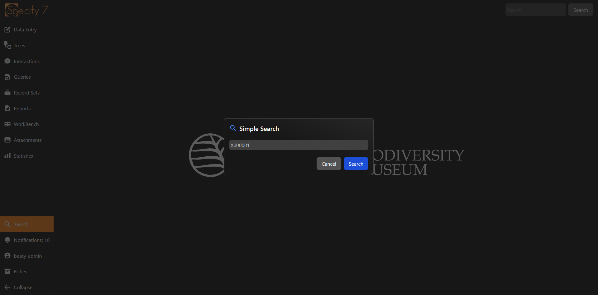

# Simple Search

Simple search is the quickest way to get to a single record provided you know the `catalogNumber` of the record.

## Learning Objectives

By the end of this page, you will:

- [ ] Be able to navigate to the simple search interface
- [ ] Open a record via its catalogNumber

## Navigating to the simple search interface

The simple search interface can be accessed by clicking on the :material-magnify: `Search` in the navigation bar. This will open a popup with a textbox that you can enter text into.

<figure markdown>
  
  <figcaption>Accessing the simple search tool from the Specify homepage</figcaption>
</figure>

!!! quote ""

    - [x] Be able to navigate to the simple search interface

## Search for a Collection Object via its catalogNumber

In the textpop that you just navigated to via the steps above, enter in the catalogNumber of the Collection Object you wish to open. A catalogNumber will always be of the form `[A-Z]######`, where the first capitalized letter is specific to a collection. 

Let's say that I want to navigate to record `X000001` in the Fish collection. I would enter `X000001` in the simple search text box, and then hit ++enter++.

<figure markdown>
  
  <figcaption>Searching for the Collection Object with catalogNumber X000001</figcaption>
</figure>

### Primary Search Results

The primary search should return exactly one result (the `Collection Object` with the `catalogNumber` you search on). You can click :material-open-in-new: to open the `Collection Object` in a new tab. Alternatively, you can click the checkbox then `Browse in Forms` to open the record in a popover.

<figure markdown>
  
  <figcaption>Searching for the Collection Object with catalogNumber X000001</figcaption>
</figure>

!!! quote ""

    - [x] Open a record via its catalogNumber

## Secondary Search Results

The secondary search section will show data that is _related_ to the `Collection Object` such as taxonomic determinations or collecting events.
