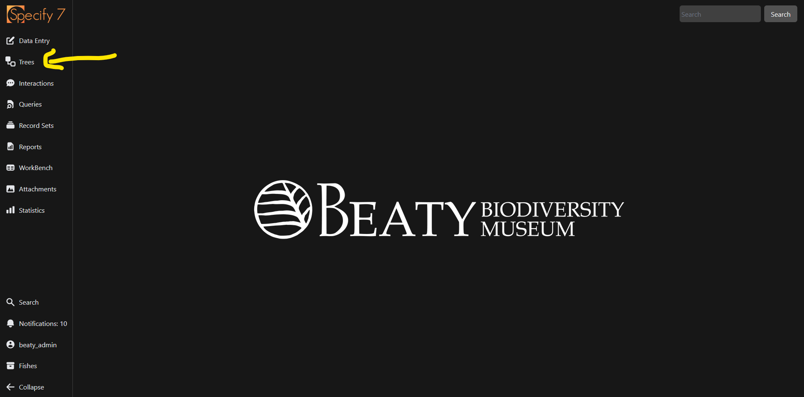
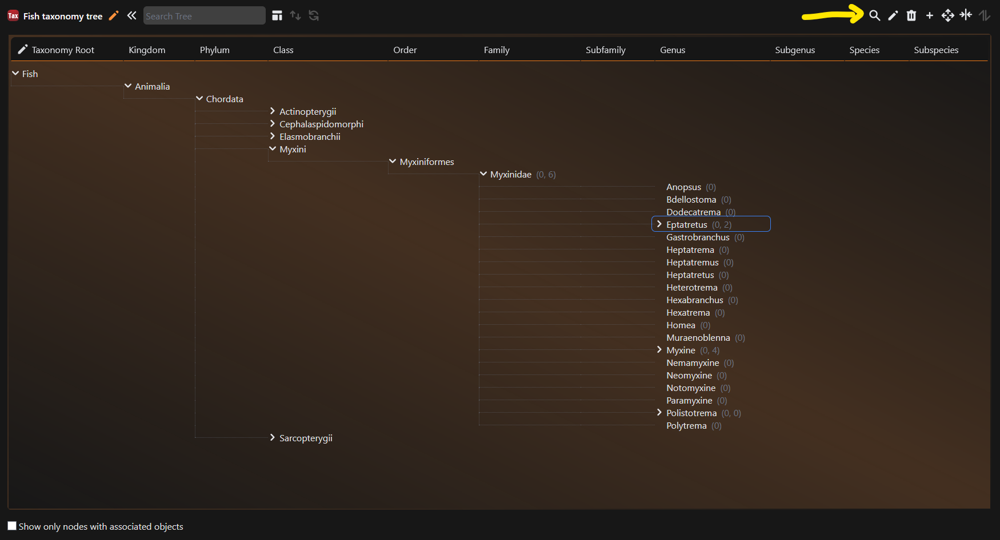

---
tags:
  - Trees
  - Specify
icon: material/file-tree-outline
---

# Trees

Specify uses a tree structure for taxonomy, storage, and geography. Trees store information that is inherently hierarchial, branching, and is used primarily for records to reference. Trees are stored locally, they do not use any external authority for reference, and are not automatically updated by any process.

## Learning Objectives

By the end of this page, you will:

- [ ] Know how to navigate to a tree
- [ ] Understand the five possible operations for trees
- [ ] Know how to use the tree to find records associated with a particular node
- [ ] Be able to add a new node to a tree via the tree interface
- [ ] Be able to remove a node from a tree via the tree interface

## Navigate to a tree

To navigate to a tree, select :material-file-tree-outline: `Trees` tab from the navigation menu.

<figure markdown>
  
  <figcaption>Navigating to the trees interface from the homescreen</figcaption>
</figure>

This will then present a popup in which you can select which tree you would like to navigate to.

<figure markdown>
  
  <figcaption>Selecting a tree from the picker</figcaption>
</figure>

Click on the tree to open up the interface for that tree.

!!! quote ""

    - [x] Know how to navigate to a tree

## Tree operations

=== ":material-arrow-collapse-horizontal: Merge"

    Merge parts of the tree. This is typically performed to correct parts of the tree that are duplicated. For instance, if the country of the United States of America were entered as both "United States" and "U.S." and both included a large number of children, a correction would require many distinct actions.

    The merge function allows users to combine all the child information and choose the accepted form of a parent. The children of the first node selected (unwanted node) will merge with those included in the node being targeted (remaining node), and the unwanted node will disappear.

    !!! danger

        A merge is very hard to reverse. Make sure that you read the description of what the merge will be doing before executing.    
    
    To perform a merge, first select the node that you want to get rid of. This will create a border around the node. Next, click on the merge icon in the top right. Finally, click on the node you wish to merge into. A dialogue will appear that will verbally describe the operation. Once you are sure you wish to perform the merge, click the Merge button.

=== ":material-cursor-move: Move "

    Move a node (and its child nodes) to a new parent. This is useful when a data entry error has occurred, or a new node has been introduced while uploading form the WorkBench. Nodes may be moved between ranks, but enforced ranks may not be skipped.

=== ":material-pencil: Edit"

    Change the node title or the details of the node. This is the easiest way to correct misspelled nodes. It can also edit details such as the author of taxon nodes.

=== "Synonymize (taxon & geo)"

    Synonymize the node (in Geography and Taxon trees only). The node that is selected first will become a synonym of the second node selected. This new preferred node is called the accepting, or target node.

    Changes in taxonomy are represented in the fields of the Determinations table. The Taxon and Preferred Taxon fields capture determinations related to Collection Objects.

    When a taxon is not a synonym, both fields with indicate the same taxon. However, if taxon (A) becomes a synonym of taxon (B), the Taxon field will still show taxon (A), while the Preferred Taxon field will be updated to taxon (B).

    By default, you cannot add child nodes to a synonymized node. Similarly, parent nodes cannot be synonymized unless their child nodes are first synonymized.

=== ":material-truck: Move items (storage only)"

    This will move all Preparations from one storage node into another. As opposed to the :material-cursor-move: `Move` operation, this would be used if you still want to keep a particular node where it is, but move items from that node into another (specimens moving from one cabinet to another for example).

    Select a storage node that contains the items you wish to move. Then click the :material-truck: icon and select the new node you wish to move the items into. A popup will appear explaining the operation, and ask you to confirm.

!!! quote ""

    - [x] Understand the five possible operations for trees

## Query for records via the tree

If you want to pull up all Collection Object's from a particular taxon node, or from a particular place, you can search directly through the tree interface. Let's say that I want to search for all records from the `Epitaretus` genus. Through the taxon tree, I can select that genus, and then use the :material-magnify: button to query on that node.

<figure markdown>
  
  <figcaption>Getting all records associated with a node in a tree. Screenshot from demo database</figcaption>
</figure>

This will run a query for records of that genus and show the results.

<figure markdown>
  
  <figcaption>Results from a query on a taxonomic node. Screenshot from demo database</figcaption>
</figure>

!!! quote ""

    - [x] Use the tree to find records associated with a particular node

## Add a new node to a tree

There will be many instances in which you will want to add a node to a tree (perhaps a new specificEpithet). To do this, you must first determine which parent that node should be under. For example, if I wanted to add a new species under `Eptatretus`, I would first select the `Eptatretus` node, and then click the :material-plus: icon to add a new child node.

<figure markdown>
  
  <figcaption>Adding a child node. Screenshot from demo database</figcaption>
</figure>

After press the :material-plus: icon, a popover will appear. The parent will be autofilled. There are two components that are required, the name of the new child you wish to create, and the rank that child node will have. 

<figure markdown>
  
  <figcaption>Adding a child node with rank Species called "For the docs". Screenshot from demo database</figcaption>
</figure>

Click `Save` to create the node. 

!!! quote ""

    - [x] Be able to add a new node to a tree via the tree interface

## Deleting a tree node

!!! warning
    A tree node cannot be deleted if it is referenced from elsewhere in the system. For example, if a taxon is referenced in a determination, or has child nodes that depend on it.

To delete a node from a tree, first select the node you wish to delete, then press the :material-trash-can: icon. A confirmation dialogue will appear asking if you are sure you wish to delete the node. 

<figure markdown>
  
  <figcaption>Delete a node from a tree. Screenshot from demo database</figcaption>
</figure>

!!! quote ""

    - [x] Be able to remove a node from a tree via the tree interface