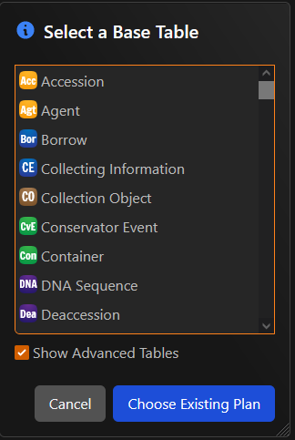
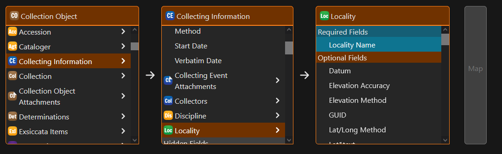
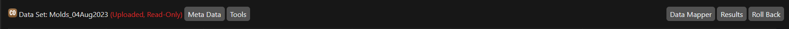

---
tags:
  - Tools
  - Workflow
icon: material/file-upload-outline
---

# Using the Workbench

The workbench is a tool that allows the user to enter a lot of records of the same type quickly and safely. The workbench should be used:

- To import large amounts of data from external collaborators or researchers.
- To migrate legacy data into Specify from another system
- When review of data is necessary before it should be included in the system.

The workbench can be thought of as a "staging" area between the outside of the database and data in the database.

## Learning Objectives

By the end of this page, you will:

- [ ] Be able to upload a spreadsheet or text file into the Workbench
- [ ] Know how to create a new mapping to align columns in the spreadsheet to fields in the Specify schema
- [ ] Know how to use an existing mapping to align columns in the spreadsheet to fields in the Specify schema
- [ ] Be able to validate data in the workbench
- [ ] Be able to upload data into the database
- [ ] Know how to rollback a previous upload
- [ ] Understand the conditions that may prevent a rollback from being successful
- [ ] Learn how to transfer a workbench to another Specify user

## Import Data from a CSV, XLSX, or TSV file

Specify 7 can import data from more traditional file types (such as `.csv`, `.xlsx` (excel), or `.tsv`) through the workbench. To get started on importing data through this method, you first must upload the file into the system.

To begin, select **Workbench** from the navigation menu.

<figure markdown>
  
  <figcaption>Accessing the Workbench from the homescreen</figcaption>
</figure>

You will be presented with a popup modal that will display three options at the bottom. Click on **Import File**. This will prompt a new screen to appear that will allow you to import a file into the system.

<figure markdown>
  
  <figcaption>Screen to import a flat file into Specify 7</figcaption>
</figure>

You may choose to either click anywhere in the box to prompt the file explorer to open for you to select the file you wish to import, or you may drag the file into the box.

!!! quote ""

    - [x] Be able to upload a spreadsheet or text file into the Workbench

### Creating a Mapping

A mapping is a set of instructions that tell Specify how to align the columns in an imported dataset to the columns present in specify. A mapping is required to successfully upload data into specify, and should be thought through carefully. To begin with, you must select a base table.

???+ warning

    If you are uploading a dataset with the Collection Object table as the selected base table, ***you must include a field mapped to catalogNumber or the Collection Object GUID***. If you do not have specific numbers that you would like to assign to records, and would instead like them to be automatically numbered by the system, insert `A######` where A is the corresponding letter for the collection you are uploading to.

    While the system will allow you to upload a dataset without this restriction being met, failure to abide by this will make rolling back the upload incredibly difficult.

<figure markdown>
  
  <figcaption>Selecting a base table</figcaption>
</figure>

**In the majority of situations the base table will the Collection Object table**. The primary exception would be if you are updating or modifying information in the taxon, geography, or storage tree.

After selecting a base table, the mapping screen will appear. This is where you tell Specify which field in the database should be used for each column in the file being uploaded. As the name implies, all fields will be in reference to the Collections Object table, but this doesn't mean you are limited to only the fields in the Collection Object table. If you wish to use a field in a different table, simply move through table relationships until you reach the field you are looking for. An example for the field `Locality Name` has been shown below. Tables that can be referenced will have a :material-greater-than: beside them.

<figure markdown>
  
  <figcaption>Using table references to map a field outside of the Collection Object table</figcaption>
</figure>

!!! quote ""

    - [x] Know how to create a new mapping to align columns in the spreadsheet to fields in the Specify schema

### Using an Existing Mapping

If you are uploading the same type of data over and over again, you may wish to copy the mapping from an existing dataset. To do this, select `Choose Existing Plan` instead of selecting a base table in the popup.

<figure markdown>
  
  <figcaption>Choosing an Existing Plan</figcaption>
</figure>

You will then be able to select a previous dataset and the mapping will be applied to the uploaded. It may be helpful to create a template file with the basic mappings, and then make further customizations on a dataset by dataset basis.

!!! quote ""

    - [x] Know how to use an existing mapping to align columns in the spreadsheet to fields in the Specify schema

### Validating Data

Before you attempt to uplaod data into Specify, you should perform a validation. A validation will ensure that the data you are attempting to upload will comply with the database schema used by Specify. If you attempt to upload without validating first, Specify will perform a validation anyways. To validate the data, press the **Validate** button in the top right of the interface.

The validation process may take some time for larger datasets. A progress bar will appear with the estimated time to completion.

!!! quote ""

    - [x] Be able to validate data in the workbench

### Uploading Data

After a validation process has been performed, and there are _no_ errors in the dataset, it can then be uploaded into Specify. To upload data, press the **Upload** button in the top right of the interface. Uploading means that the data will be added to the Specify database.

Similar to the validation process, a progress bar will appear showing the estimated time to completion. When data is updated successfully, a statement will appear at the top of the interface indicating that the dataset has been uploaded and is now read only.

<figure markdown>
  
  <figcaption></figcaption>
</figure>

!!! quote ""

    - [x] Be able to upload data into the database

#### Results

If you would like to see how many records were updated for each table, you can use the **Results** button in the header. This will display a side panel that will display such statistics. This will also allow you to create a **Record Set**, which is covered elsewhere in this documentation.

#### Rolling Back an Upload

While the dataset remains in your workbench, you can roll back an upload if there was an error that was made, or you would otherwise like to take the data back out of the system. To do this, simply hit the **Roll Back** button in the header.

!!! danger

    Rollbacks cannot be performed if there have been anything changes to the data uploaded. This can include things you may not think of, such as another user linking an object to a storage node. Rollbacks should be used as a last resort, and not relied upon as a reason to be careless when uploading data.

!!! quote ""

    - [x] Know how to rollback a previous upload
    - [x] Understand the conditions that may prevent a rollback from being successful

## Transferring Ownership of a Dataset to Another Specify User

At any time in the above process it may be useful to transfer ownership of the dataset to another user. This may be because they will continue to work on it, or they may be asked to review it before the data is uploaded to the database. To transfer ownership of a dataset you are working on to another user click `Tools` to the right of the dataset name, then `Change Owner`. Then, select the user that you wish to transfer the dataset to.

!!! quote ""

    - [x] Learn how to transfer a workbench to another Specify user