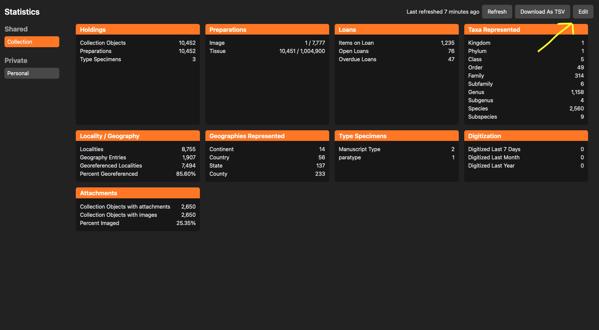

# Easily view recently created records

It can be helpful to see recently created or modified records at a glance. This can be helpful to look over the previous day's work, to keep track of changes in a collection, or to quickly jump back into where you left off.

## Building a query to return all recently created records

A query to look for records created in the last 2 weeks would look like this.

| Field | Operator | Value |
| ----- | -------- | ----- |
| Catalogue Number | Any | N/A |
| Timestamp Created | Less Than {Relative} {Weeks} {in the past} | 2 |

By clicking on the :material-circle: to the right of the Timestamp Created row, the results can be sorted. To see the most recent results at the top, click the button until you see this icon :material-arrow-down-bold-circle:.

You can then browse through the records by clicking `Browse in Forms` in the upper right hand corner of the results window. As you scroll through the records with :material-chevron-left: and :material-chevron-right: they will be in the order of creation, beginning with the records created most recently.

Save the query as "Recently created records".

## Building a query to return all recently modified records

The query for modified records looks the same as the above, except `Timestamp Modified` is used instead of `Timestamp Created`.

| Field | Operator | Value |
| ----- | -------- | ----- |
| Catalogue Number | Any | N/A |
| Timestamp Modified | Greater Than {Relative} {Weeks} {in the past} | 2 |

## Adding both queries to the statistics panel

Both of the above queries can be added in the statistics panel for a collection. To add the queries first navigate to the statistics panel.

<figure markdown>
  
  <figcaption>Navigate to the statistics page from the homescreen</figcaption>
</figure>

Next, press `Edit` to edit the statistics that are displayed on the page

<figure markdown>
  
  <figcaption>Edit statistics on the statistics panel. Screenshot from demo database</figcaption>
</figure>

You can then add the recently created queries to a statistics group. 

<figure markdown>
  
  <figcaption>Add query to stastics group. Screenshot from demo database</figcaption>
</figure>

A a popup will appear allowing you to use a query or a default statistic to use. Select the name of the recently created query to add it to the statistics page.
